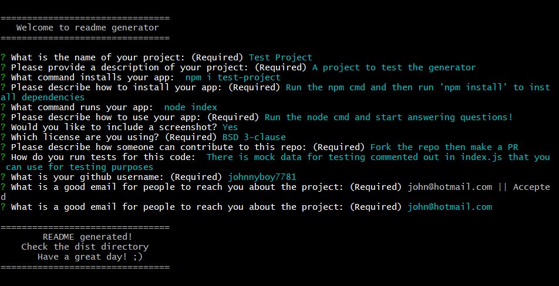

  # Readme Generator
  [](https://opensource.org/licenses/MIT)

  # *** This README was generated with this tool! ***

  ## Description
  This command line tool will generate a high-quality README for your project! Just answer a few questions and start generating!

  ## Table of Contents
   - [Installation](#installation)
   - [Usage](#usage)
   - [Contributing](#contributing)
   - [Tests](#tests)
   - [Questions](#questions)
   - [License](#license)
    

  ## Installation
  Clone this repo and run 'npm install' to install dependencies  
  

  ## Usage 
  Simply run the node command and start answering the provided questions! When finished, your ready-to-use readme will be located in the 'dist' folder  
  ```node index```    
    
  Check out this video demo: https://www.youtube.com/watch?v=EzJDciGMvUg&ab_channel=JonathanMcDonnell

  

  ## Contributing
  Simply fork the repo and make a PR and I will review it when I can.

  ## Tests
  There is mock data that is commented out in index.js. Uncomment that and feed it write into the generateMarkdown function to test and debug.

  ## Questions
  Please refer all questions about this repo to github user [@johnnyboy7781](https://github.com/johnnyboy7781)  
  A good email to reach this person at is: mcdonnell.jonathan@yahoo.com

  
  ## License
  [](https://opensource.org/licenses/MIT)  
  This repo is covered under the MIT license.  
  Please refer to the following link for more information: https://opensource.org/licenses/MIT
  
  